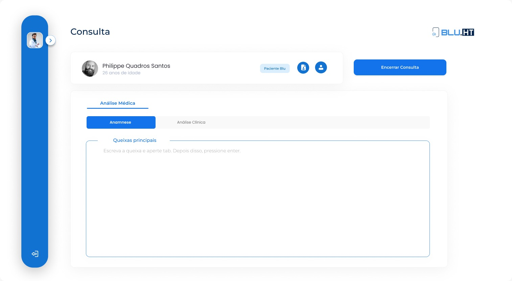
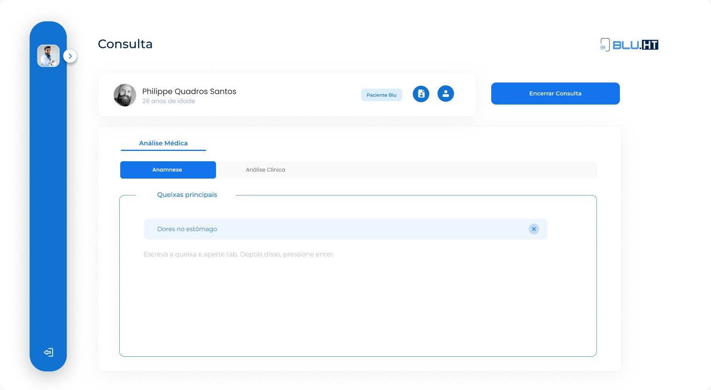
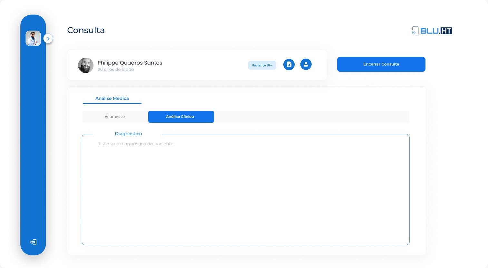
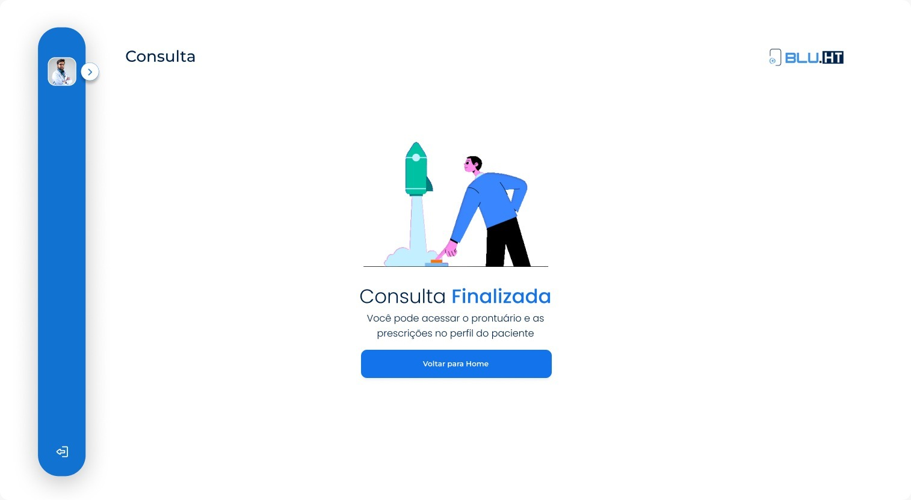

# Challenge Frontend - Blu

Bem vindo ao Code Challenge destinado as vagas de Engenheiro Frontend da Blu!

Esse é um teste de nivelamento que é destinado a todos os níveis de carreira. Focamos aqui em design de código e design patterns em JavaScript. O objetivo é avaliar sua experiência em escrever código de fácil manutenção, baixo acoplamento e alta coesão.

## Requisitos mínimos (obrigatórios)

Esses são requisitos obrigatórios e devem ser cumpridos a fim de possibilitar que esse teste técnico seja devidamente avaliado.

### Funcionais

O candidato deve:

- Criar a página completa

- Permitir que o usuário insira as queixas principais do paciente ao clicar na tecla "Enter"

- Criar a aba de análise clínica

- Assim como a página de sucesso ao clicar em "Encerrar consulta"

### Não funcionais

- Concluir o desafio utilizando, ao mínimo, HTML, CSS e JS fazendo o máximo uso possível das boas práticas. A entrega pode ser feita através de um respositório git ou em uma pasta zipada e enviada para o e-mail da equipe da Blu.

## Requisitos adicionais (opcionais)

Esses são requisitos opcionais. Eles não precisam ser cumpridos e não possuem caráter eliminatório, todavia, a depender da senioridade do candidato, eles podem se tornar obrigatórios pois oferecem um panorama mais completo com relação às habilidades do candidato.

Os requisitos opcionais incluem, não se limitando à:

- Responsividade
- Transições e efeitos
- Integrar a solução com algum serviço externo (utilizando uma API Rest, GraphQL ou qualquer outro paradigma de comunicação conveniente)
- Utilizar React, React Native ou qualquer outra biblioteca ou framework JavaScript
- Adicionar e configurar linters e formatadores
- Adicionar testes automatizados (sejam unitários, de integração ou end-to-end)
- Estabelecer uma configuração mínima e funcional de CI/CD
- Realizar o deploy da aplicação em algum servidor/cdn
- Dockerizar a app
